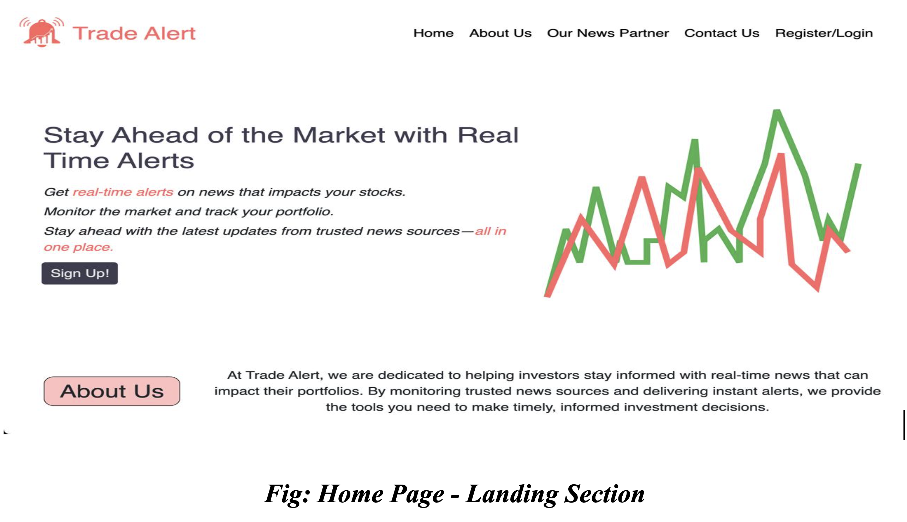
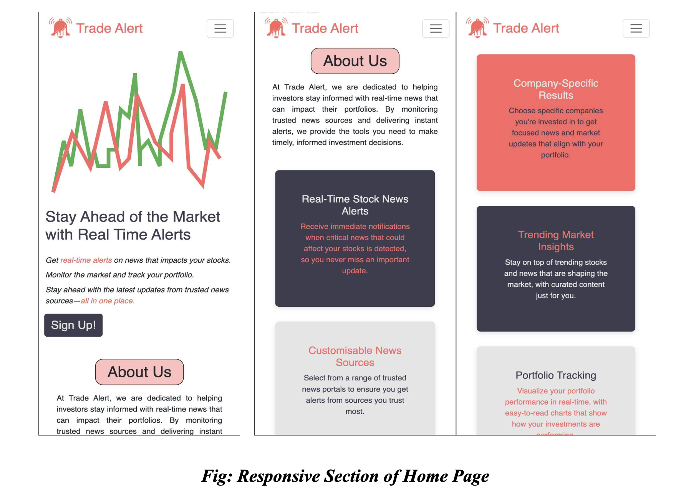
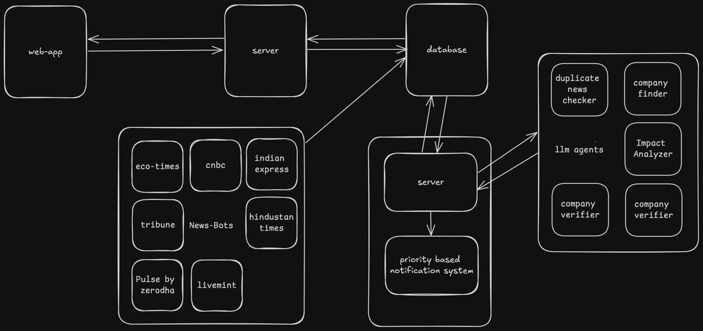

# Trade Alert 📈

A real-time financial news analysis system that uses AI to provide actionable stock market insights. The system scrapes news from multiple sources, analyzes its potential impact on stocks using LLM, and sends timely notifications to users.

## 🌟 Features

- Real-time news scraping from 8 major financial news portals
- AI-powered news analysis using Groq's LLM APIs
- Automated stock impact prediction
- Real-time notifications via Firebase Cloud Messaging
- Email alerts through Nodemailer
- Responsive web interface built with MERN stack
- Docker containerization for scalable deployment

## Built after designing

[Checkout the initial figma design](https://www.figma.com/design/2vzfnx0l4Ay1ebJJy0YIMY/Red-Alert?node-id=0-1&t=sN537kqPnqVjTkzr-1)

## 🎥 Demo

[Watch the demo video](https://youtu.be/BYqgeYKpoJs)

## 📸 Screenshots of pages not in Demo

### Home Page



### Responsive Design



### Notifications

<div align="center">
  <div style="display: flex; justify-content: center; gap: 20px;">
    
    
  </div>
</div>

## 🏗️ Architecture



## 🚀 Getting Started

### Prerequisites

- Node.js 16+
- MongoDB
- Docker & Docker Compose
- Firebase account
- Groq API key

### How to run the project

1. Clone the repository

    ```bash
    git clone https://github.com/harshsharma20503/trade-alert.git
    cd trade-alert
    ```

2. Install dependencies

    ```bash
    # Install backend dependencies
    cd backend
    npm install

    # Install frontend dependencies
    cd ../frontend
    npm install

    # Install news-bots dependencies
    cd ../news-bots
    npm install

    # Install notification-service dependencies
    cd ../notification-service
    npm install
    ```

3. Set up environment variables

    - Create .env in all the folders and set the credentials as given the .env.example

4. Create a mongodb database and insert the trade-alert-companies.json data into a companies collection.

5. Get your firebase service account and save it in notification-system folder and name it as `firebase-service-account-config.json`.

6. Run the project

    - See the scripts from the package.json to run the project with appropiate commands.

## 👥 Team

- Harsh Sharma ([@harshsharma20503](https://github.com/harshsharma20503))
- Paakhi Maheshwari ([@paakhim10](https://github.com/paakhim10))
- Deepti Jain ([@deepti1028](https://github.com/deepti1028))
